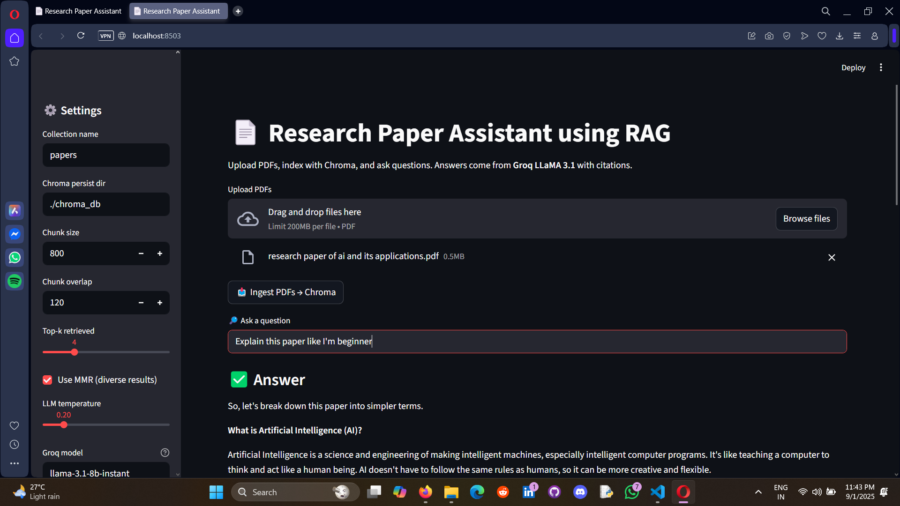
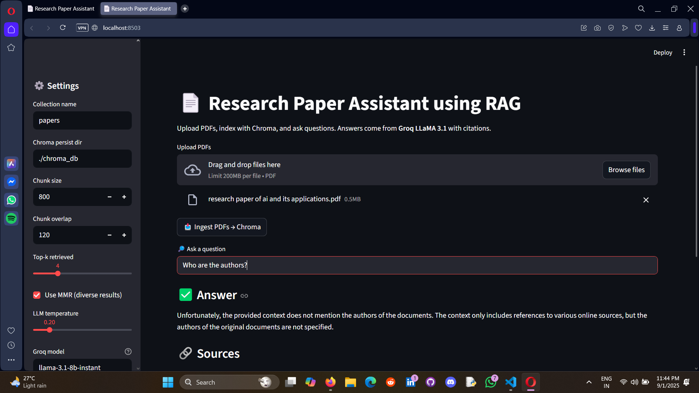

# Research Paper Assistant using RAG

This project is a Research Paper Assistant built with Retrieval-Augmented Generation (RAG). The application allows you to upload research papers in PDF format and then ask natural language questions about their content. It combines vector search with large language models to retrieve relevant passages and generate answers with supporting context.




## Features

* Upload one or more PDF research papers.
* Automatically process and split documents into manageable text chunks.
* Store embeddings in a ChromaDB vector database for fast retrieval.
* Ask questions in plain English and receive context-aware answers.
* Answers include references to the source document and page numbers.
* Configurable parameters such as chunk size, overlap, retrieval method, and LLM model.

## Tech Stack

* **LangChain** for orchestration
* **Groq API** with LLaMA 3.1 models for question answering
* **ChromaDB** for vector storage and retrieval
* **HuggingFace Sentence Transformers** for embeddings
* **Streamlit** for the user interface

## Installation

1. Clone the repository:

   ```bash
   git clone https://github.com/<your-username>/Research-Paper-Assistant-using-RAG.git
   cd Research-Paper-Assistant-using-RAG
   ```

2. Create and activate a virtual environment:

   ```bash
   python -m venv .venv
   .venv\Scripts\activate      # Windows
   ```

3. Install dependencies:

   ```bash
   pip install -r requirements.txt
   ```

4. Configure environment variables:

   * Add your Groq API key and adjust other settings if needed

5. Run the application:

   ```bash
   streamlit run app.py
   ```

## Usage

1. Start the application in your browser.
2. Upload one or more PDF files of research papers.
3. Click the ingestion button to index the documents into ChromaDB.
4. Ask your questions in the text box.
5. View the generated answer, the referenced sources, and the retrieved context.

## Example Questions

* What are the key contributions of this paper?
* How does the proposed method compare with existing approaches?
* What datasets were used in the experiments?
* Summarize the conclusion of this paper.

## Notes

* Default embeddings are generated using `sentence-transformers/all-MiniLM-L6-v2`.
* Default Groq model is `llama-3.1-8b-instant`, but this can be changed in the settings panel.
* ChromaDB is configured to persist locally, so your indexed papers are saved between runs.

## Author

👨‍💻 **Sarathkumar Soundarrajan**
📌 LinkedIn: (https://www.linkedin.com/in/sarathkumar271002/))
📌 GitHub: (https://github.com/sarathkumar271002)


